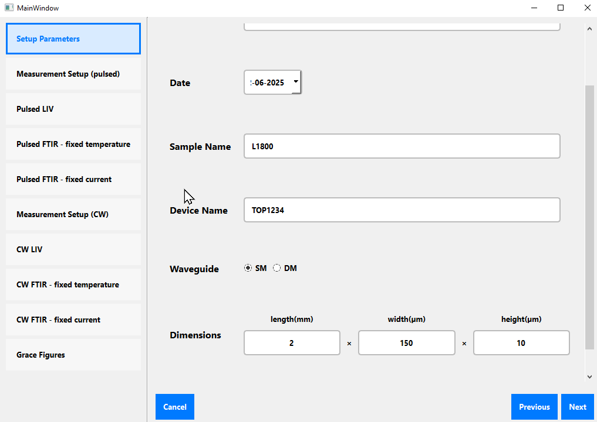
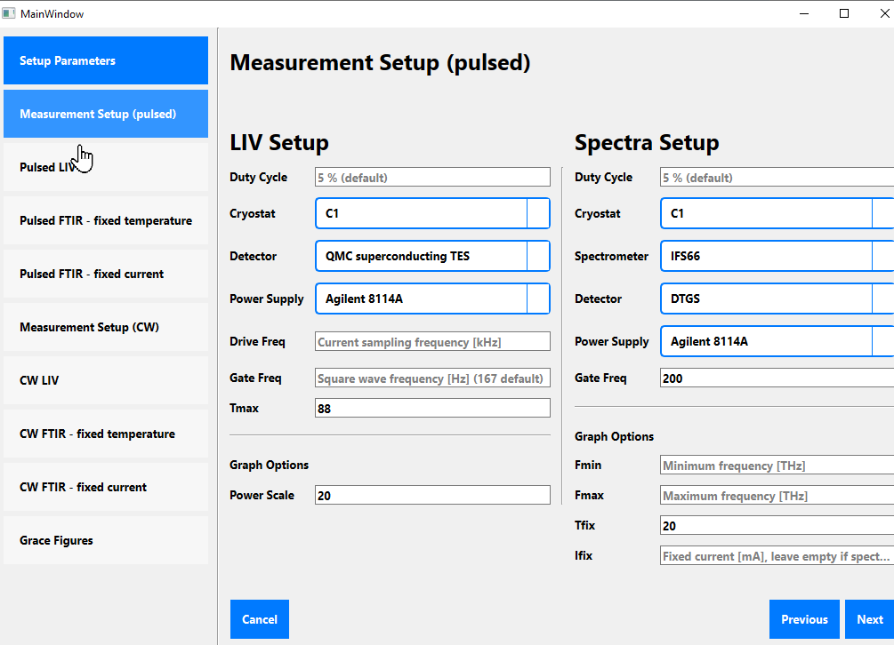
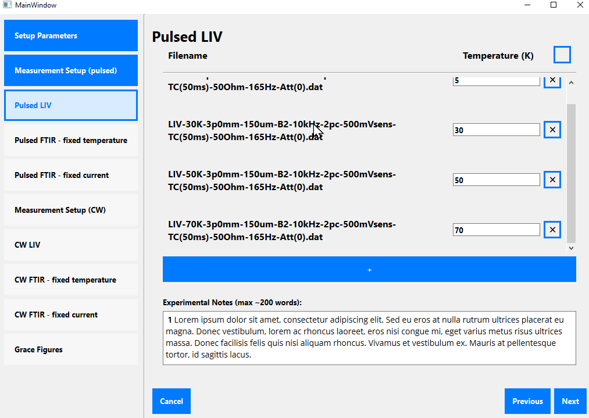
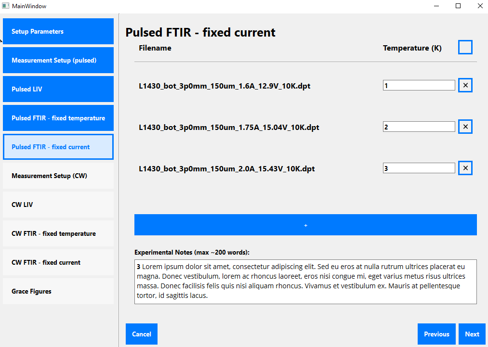
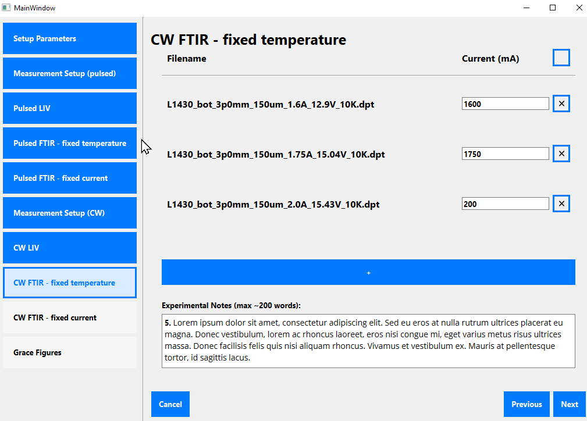
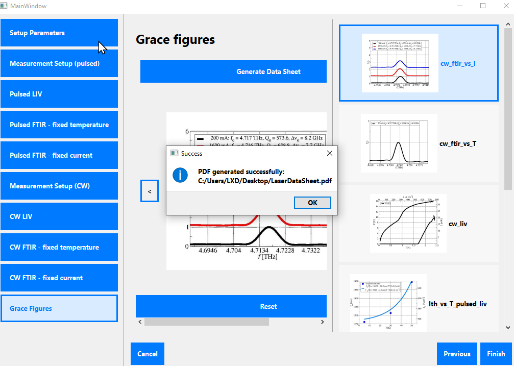
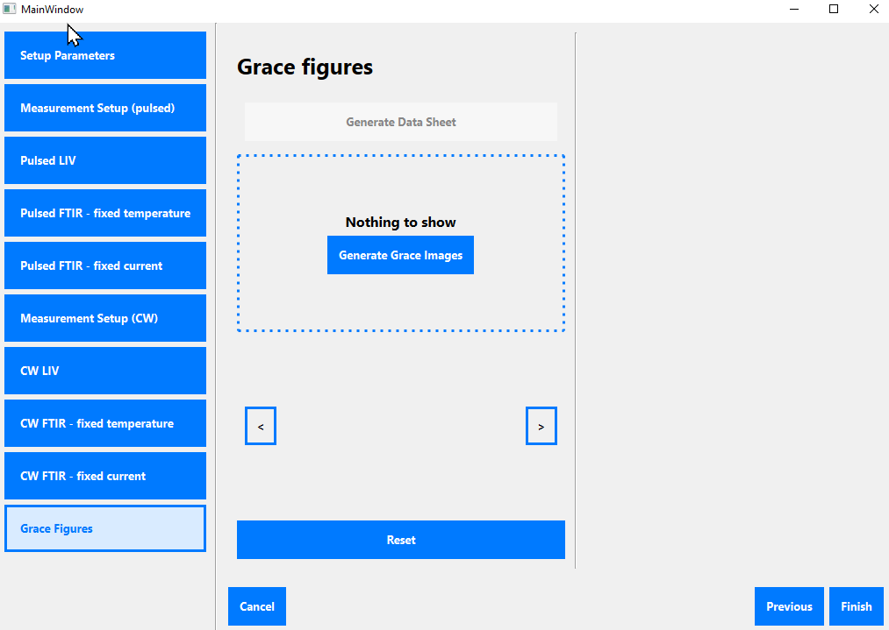

# qcl_characterization_manager

This is a GUI interface based in Qt for making LIV and FDR plots with relation to quantum-cascade lasers.

## Generating Graphs Using Files

To generate graphs from a series of text files, first **Start wizard** to input necessary parameters. Then, you will find the needed graphs in the **Analyze files** page.

|        |     |
| ------------------------------------------------- | ----------------------------------------------------------------- |
|           |    |
|  |  |
   
## Viewing Graphs From Directory

To view graphs loaded from a directory, simply press **Analyze files** immediately upon startup. You can then load image files from some directory for viewing.

|           |    |
| ------------------------------------------------- | ----------------------------------------------------------------- |

The GUI fully builds a datasheet and .pdf and .png images from the selected data files.
